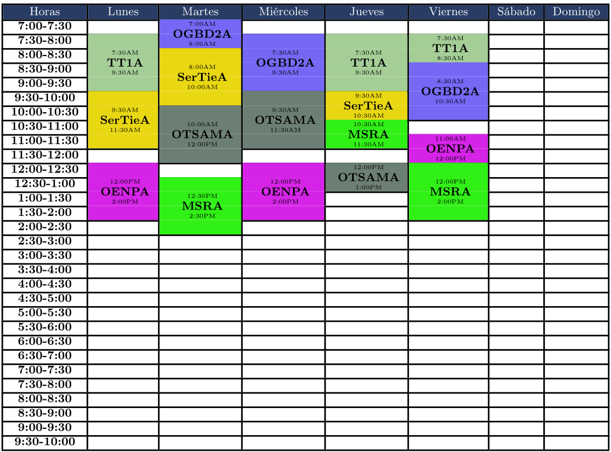
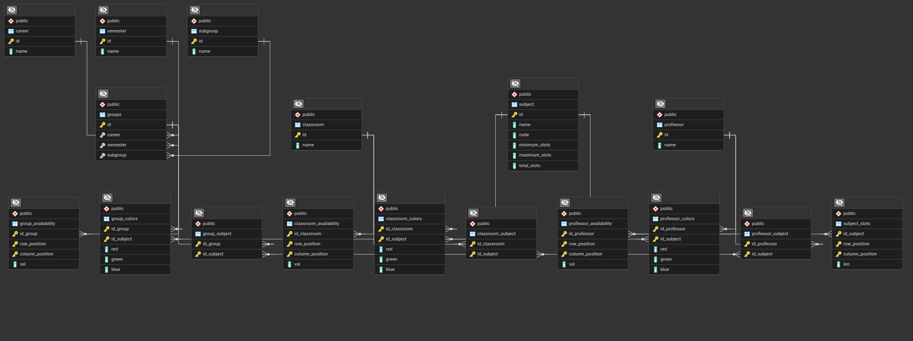
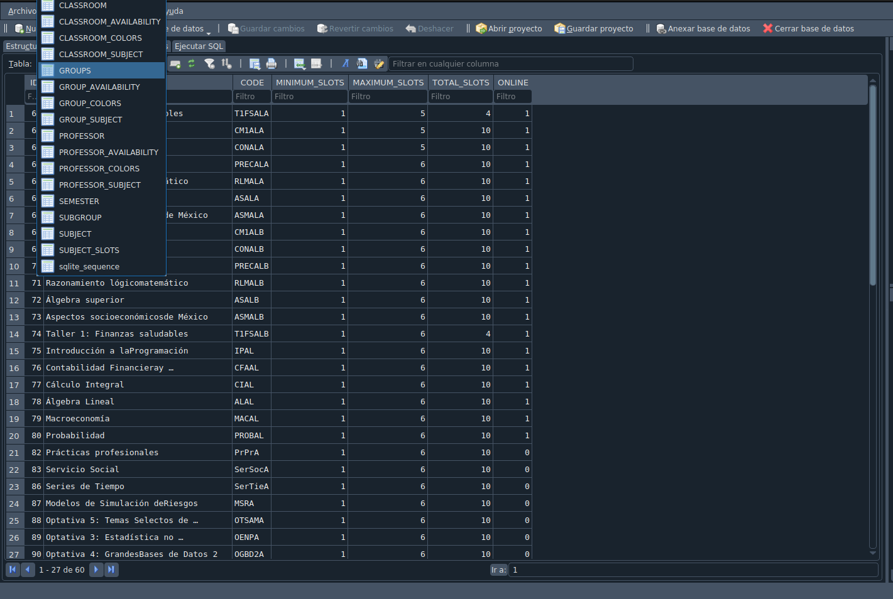
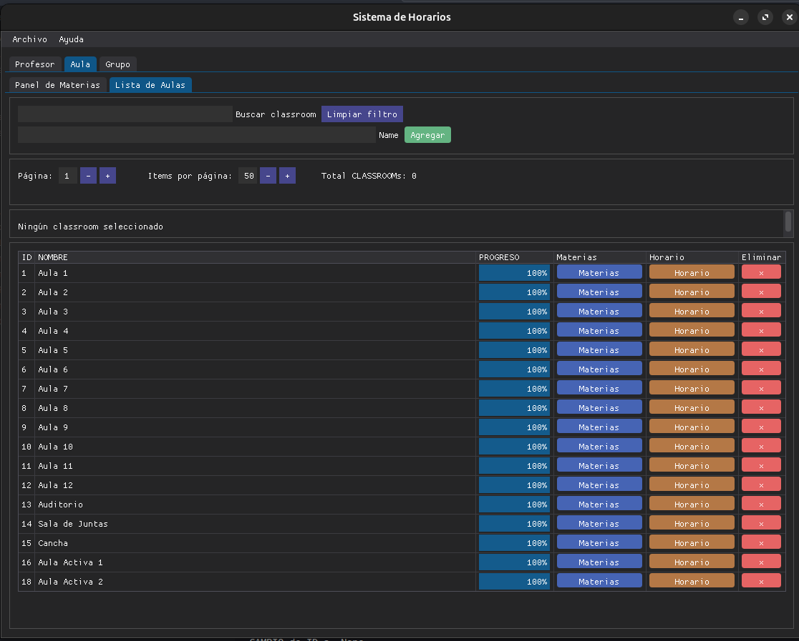
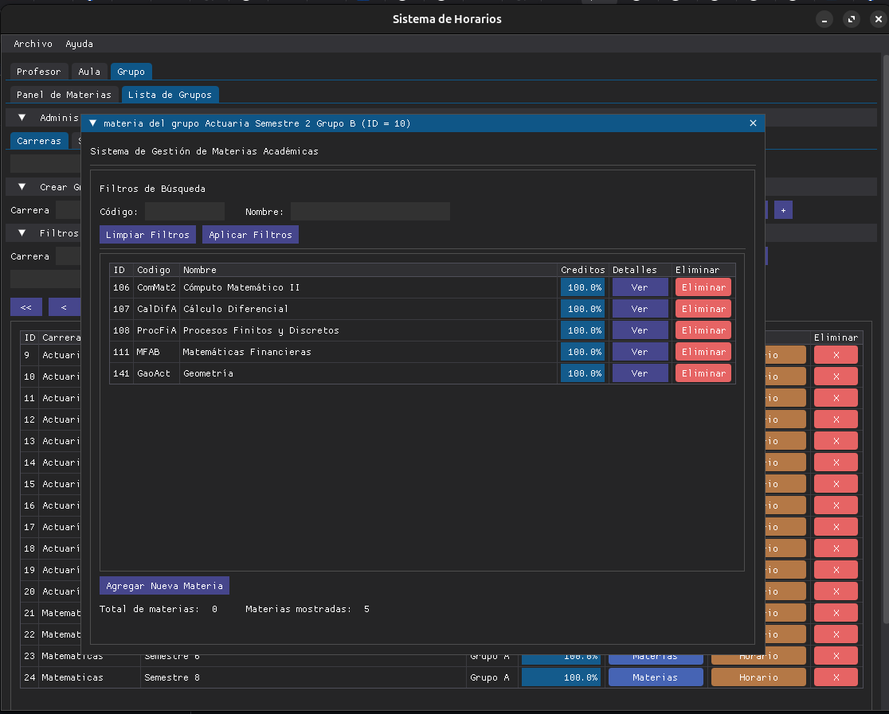
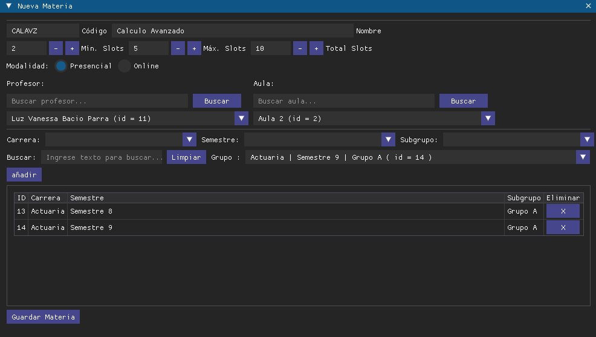
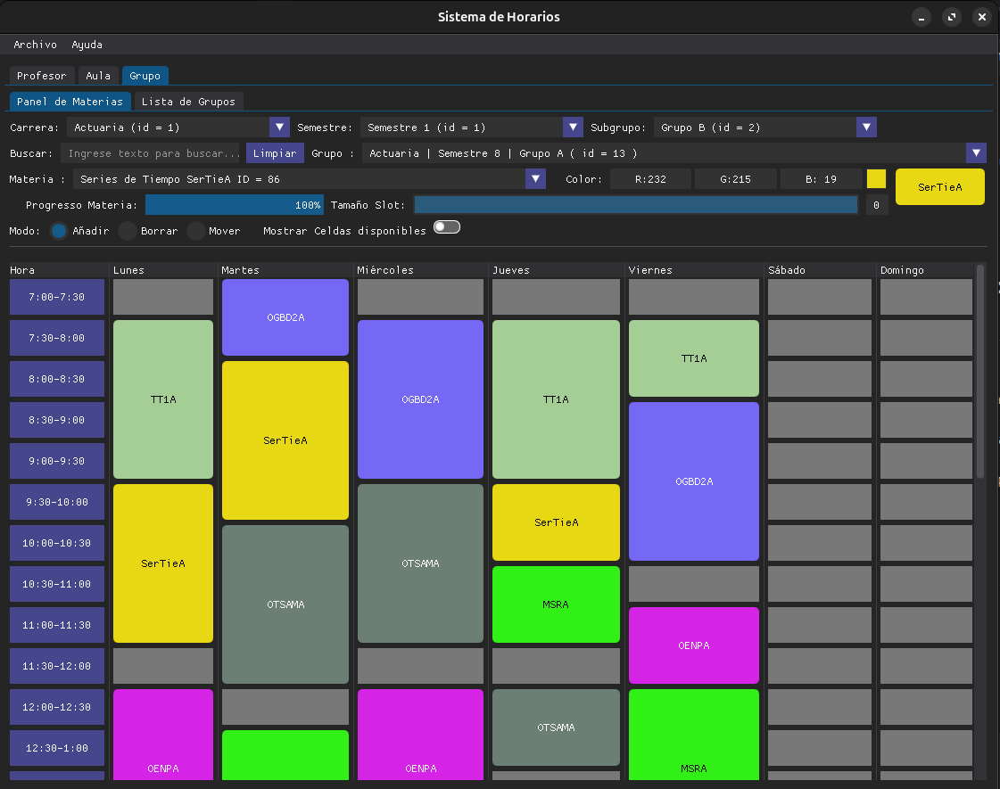

## ✅ Requisitos Previos

Asegúrate de tener instalado lo siguiente:

- Python 3.8 o superior
- `pip` 
- git
- (Opcional) Crear un entorno virtual para aislar dependencias (obligatorio si estas en linux)

## ⚙️ Instalación

1. **Clonar repositorio e instalar dependencias**:

```bash
   git clone --depth 1 https://github.com/juan15377/TimeTables.git
   cd TimeTables
   pip install -r requirements.txt 
   ````

2. **Correr el fichero de arranque**:

````bash 
    python -m src
````




hola











