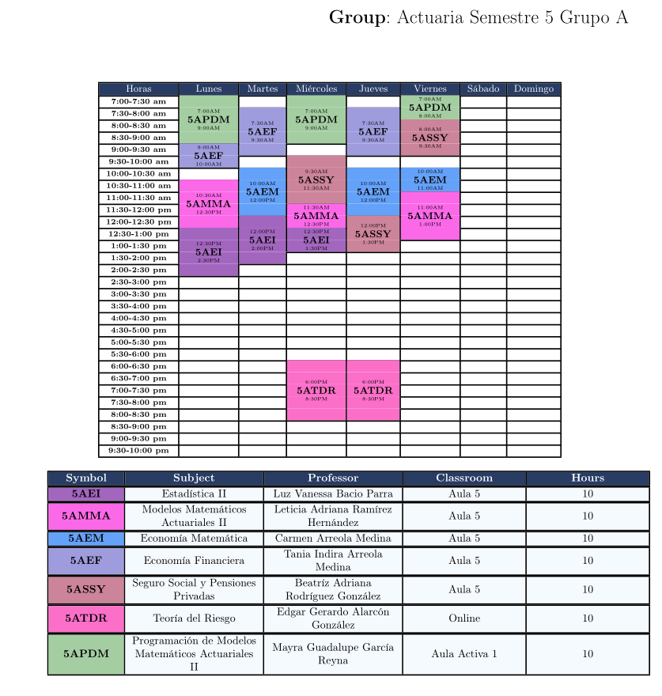

# 🕒 TimeTables

System for managing and generating academic timetables with PDF export via LaTeX.  
Project developed for the Academic Unit of Mathematics at the Autonomous University of Zacatecas.

---

## ✅ Prerequisites

Make sure you have the following installed:

- **Python 3.8 or higher**
- **pip** (Python package manager)
- **git** (version control system)
- **LaTeX** (required for PDF export)

---

### LaTeX Installation

**Windows:**
```bash
# Option 1: MiKTeX (recommended)
# Download and install from: https://miktex.org/download

# Option 2: TeX Live
# Download and install from: https://www.tug.org/texlive/

# Option 3: Using Chocolatey (if installed)
choco install miktex
```

**macOS:**
```bash
# Option 1: MacTeX (recommended)
# Download and install from: https://www.tug.org/mactex/

# Option 2: Using Homebrew
brew install --cask mactex

# Option 3: Basic (lightweight) installation
brew install basictex
```

**Linux:**
```bash
# Ubuntu/Debian
sudo apt update
sudo apt install texlive-full

# Minimal installation (faster)
sudo apt install texlive-latex-base texlive-latex-recommended texlive-latex-extra

# CentOS/RHEL/Fedora
sudo yum install texlive-scheme-full
# Or on recent Fedora:
sudo dnf install texlive-scheme-full

# Arch Linux
sudo pacman -S texlive-most

# openSUSE
sudo zypper install texlive-latex
```

**Verify LaTeX installation:**
```bash
latex --version
pdflatex --version
```

> **(Optional but recommended)** Create a virtual environment to isolate dependencies (required on Linux)

---

## ⚙️ Installation

1. **Clone repository:**
   ```bash
   git clone --depth 1 https://github.com/juan15377/TimeTables.git
   cd TimeTables
   ```

2. **Create virtual environment (recommended):**
   ```bash
   # Create virtual environment
   python -m venv venv
   
   # Activate virtual environment
   # On Windows:
   venv\Scripts\activate
   
   # On macOS/Linux:
   source venv/bin/activate
   ```

3. **Upgrade pip:**
   ```bash
   python -m pip install --upgrade pip
   ```

4. **Install dependencies:**
   ```bash
   pip install -r requirements.txt
   ```

5. **Run the application:**
   ```bash
   python -m src.main
   ```

---

## Database Model

This image shows the relational model of the database:


---

## Screenshots

### Main Page


### Classroom View


### Add New Subject


### PDF Export Example



---

## Troubleshooting

### LaTeX compilation error
- Make sure all required packages are installed
- If you’re using a minimal installation, install additional packages as needed

